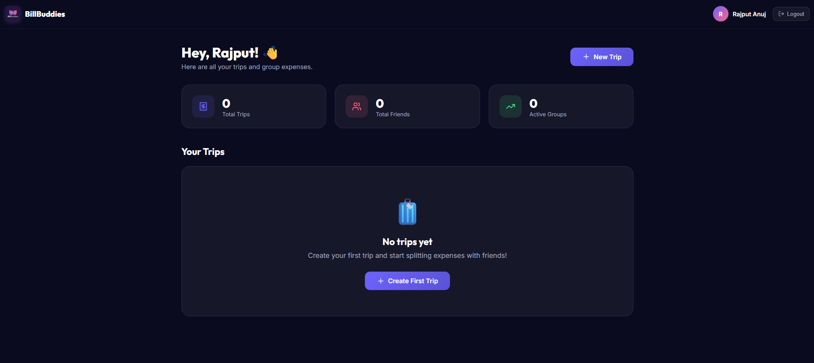

<!-- 🔥 PREMIUM HEADER -->
<h1 align="center">💸 BillBuddies</h1>

<p align="center">
  <b>Split Expenses • Track Balances • Settle Faster</b>
</p>

<p align="center">
  <a href="https://billbuddies.online">
    
  </a>
  
  
</p>

---

<!-- 🔥 ANIMATION -->
<p align="center">
  
</p>

---

## 🚀 About BillBuddies

**BillBuddies** is a modern web app that helps you **split expenses with friends**, track balances, and manage group spending effortlessly.

No more confusion. No more calculations. Just simple and smart expense tracking.

🌐 **Live App:** https://billbuddies.online  

---

## ✨ Key Features

- 💰 Smart Expense Splitting (Equal & Custom)
- 📊 Real-Time Balance Calculation
- 👥 Group Expense Management
- 🔔 Payment Reminders (Manual / WhatsApp Ready)
- ⚡ Clean & Fast UI
- 📱 Fully Responsive Design

---
##🛠️ Tech Stack

<p align="center">  </p>

---

##📸 Screenshots

<p align="center">    </p>

## 🧠 How It Works

```mermaid
graph TD;
A[Create Group] --> B[Add Expenses];
B --> C[Split Automatically];
C --> D[Track Balances];
D --> E[Send Reminders];
