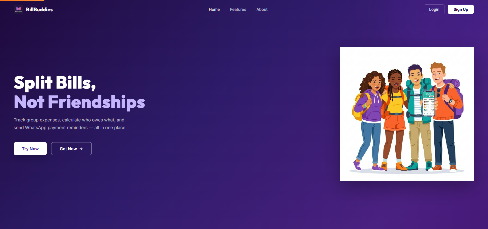

# 💸 BillBuddies – Split Expenses with Friends Easily

BillBuddies is a simple and fast web app to **split expenses with friends**, track balances, and send payment reminders — all in one place.

🌐 Live Demo: https://billbuddies.online

---

## 🚀 Features

- 💰 **Split Expenses Instantly**
  - Equal split
  - Custom split
- 📊 **Track Who Owes Whom**
- 🔔 **Send Payment Reminders (WhatsApp / Manual)**
- 👥 **Group Expense Management**
- ⚡ **Fast & Simple UI**
- 📱 **Mobile Friendly Design**

---

## 🛠️ Tech Stack

| Frontend        | Backend        | Database     | DevOps        |
|-----------------|--------------|--------------|--------------|
| React / Next.js | Node.js / API | MongoDB      | AWS / Linux  |
| Tailwind CSS    | Express       |              | CI/CD (GitHub Actions) |

---

## 📸 Screenshots

| Dashboard | Split Expense | 
|----------|--------------|--------|
|  |  |
---

## 🧠 How It Works

1. Create a group or add friends  
2. Add expenses (who paid, amount, split type)  
3. BillBuddies calculates balances automatically  
4. See who owes whom instantly  
5. Send reminders to settle payments  

---

## 📦 Getting Started

### 1️⃣ Clone the Repository

```bash
git clone https://github.com/rana199anuj/BillBuddies.git
cd BillBuddies
